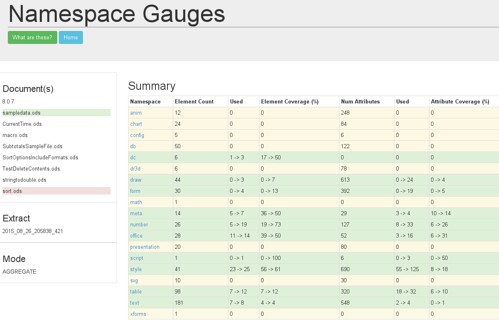

### What's in the Aggregation Namespaces Table?

The resulting summary table for the first iteration of aggregation is below.

It shows the changes cumulitive coverage of the documents.

There is a bit more than meets the eye going on here.

The figures showing the changes, for instance dc coverage 17->50, is between the start and end document.
Start being the one with the green background and end (you guessed it) the red background.

The start and end documents can be moved. Simply click on them, they will bounce up and down like balls in that old game pong. And the numbers will change to show the coverage difference between the two documents.
So we can get a way of seeing which documents contributed changes to the coverage. Or, perhaps more importantly, those that did not increase coverage at all.

Also, notice that the names of the namespaces are links? There is a graph under there which shows the progrssive increase in coverage for the namespace.

This is the number graph.

### Drilldown

Again you may well wonder which documents hit which elements and attributes.

Follow the red elements in the Drilldown table to see differences.
Some are there just because we have different number of hits.

The handy dandy pop up shows the contributions from the different documents.

