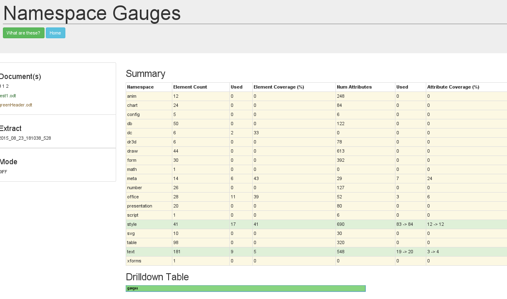
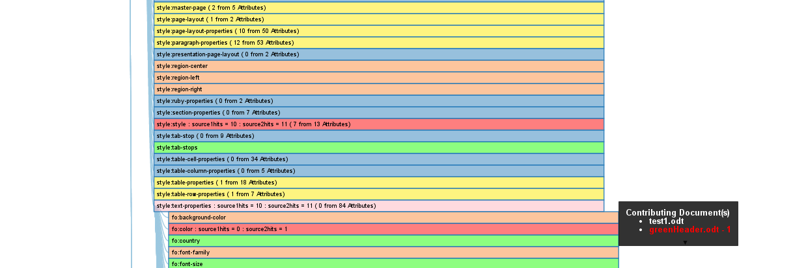

### What are the differences?

The resulting summary table for our comparison is below.

It shows the changes we made hit a couple of attributes we did not use in the original document.

### Drilldown

Of course you may well wonder which new attributes where hit.

Follow the red elements in the Drilldown table to see differences.
Some are there just because we have different number of hits.

The handy dandy pop up shows the contributions from the different documents, and the fo:color attribute was used in the new document.

