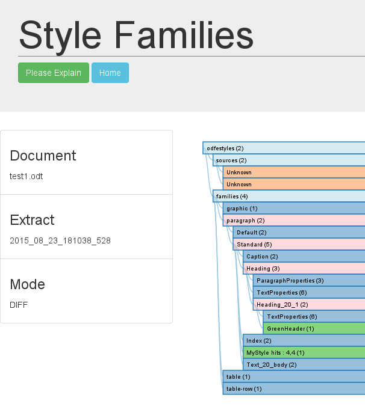

### Compare Style Families

The drilldown table is the same as that described in the [single](StyleFamiliesSingle.html) case.

However there are colours to highlight the changes. Red/pink means change below, green is an added item.

So we can see our two new styles, our GreenHeader derived from Heading_20_1 and MyStyle derived from Standard.

