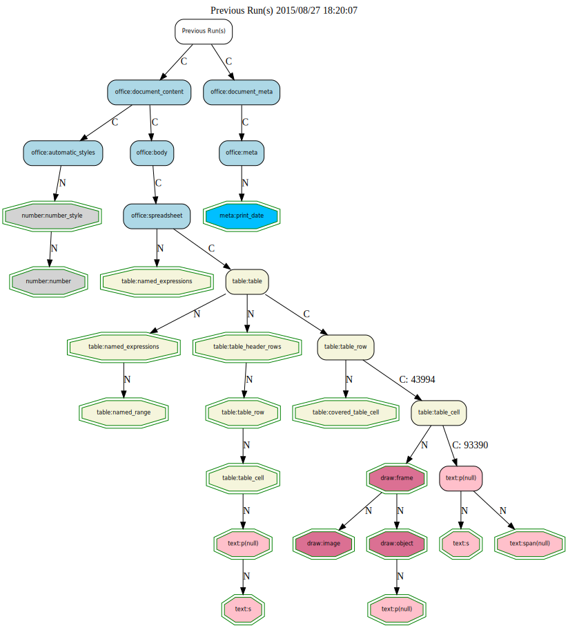

### XPath Graph Aggregation

The graph below is after a second aggregation iteration. And is filtered to show the changes only.

The results of the aggregation are accumulated on top of any previous runs. So filtering on changes only shows the xpaths added.

It may be best to aggregate one document at a time? If your aim is the see the changed introduced by single documents then that is the case. But if you just want the overall picture process them in decent sized groups.