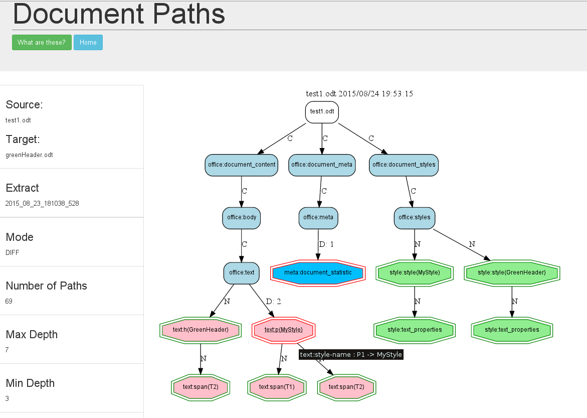

### XPath Graph Comparison

The graph in the difference report is just the same as that of the [single](XPathGraphSingle.html) case.

But the graph nodes change shape where changes are detected, whoo hoo, hexagons. They also have a coloured border, green for new, red for changed.
And the tooltip shows the attributes of the element that have changed.

The tool also provides a way to redraw the graph showing only the changes. Check the 'XPath Changes Only' button and click on submit.

For our edited document this produces...

