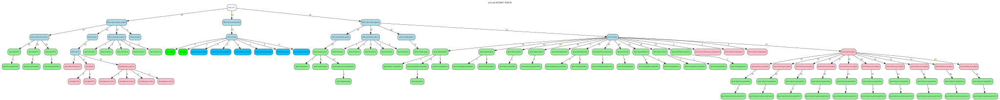
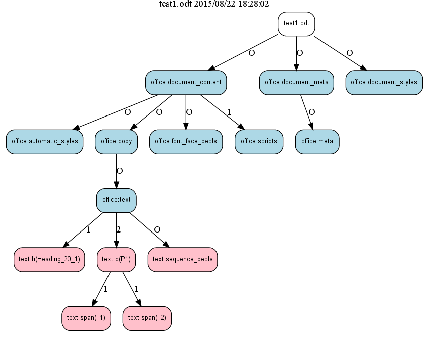
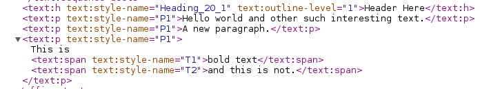

### XPath Graph

The full XPath Graph contained within the column of this page is below.
This just shows how wide and shallow the tree is.
Here is a link to [the full image](images/xpathgraph.svg).
Hovering over an element will show a tooltip with its properties (at least those that fit into the tooltip - may have to work on that).

The ODF Explorer presents the graph within its framework and provides a mechanism to filter out sections ot the tree.
To hide a section click on a node and it will be added to the filter list.

Here is a filtered view to show the elements below the document_content/body/text.

### Where do the numbers come from?

In order to understand the numbers lets peek into the XML.

There is one path to the heading.
There are two paths the end in a text:p.
There are two separate paths below a text:p to the two T1 and T2 span elements.

This is how the original document with its heading and three paragraphs, one with some bold text, show up.

### What to the names mean?

The element names are of the form namespace:element.
For paragraphs and headings the associated style is in paranthesis ... para(style).

### What do the colours signify?

The colours are derived from the namespace.

