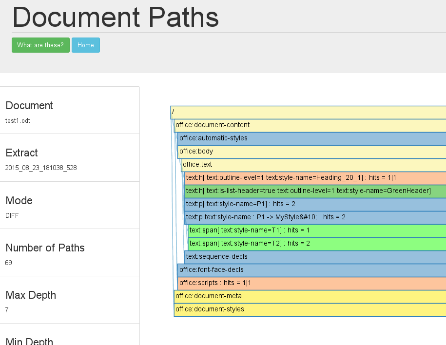

### XPath Drill Down Compare

The drilldown table is the same as used in the [single](XPathTableCompare.html)

The view shows the drill down to the elements under the document/body/text.

Yellow indicates something of interest 'open me'. Green entries are new.
The differences are supposed to be red... bit of a bug there.

