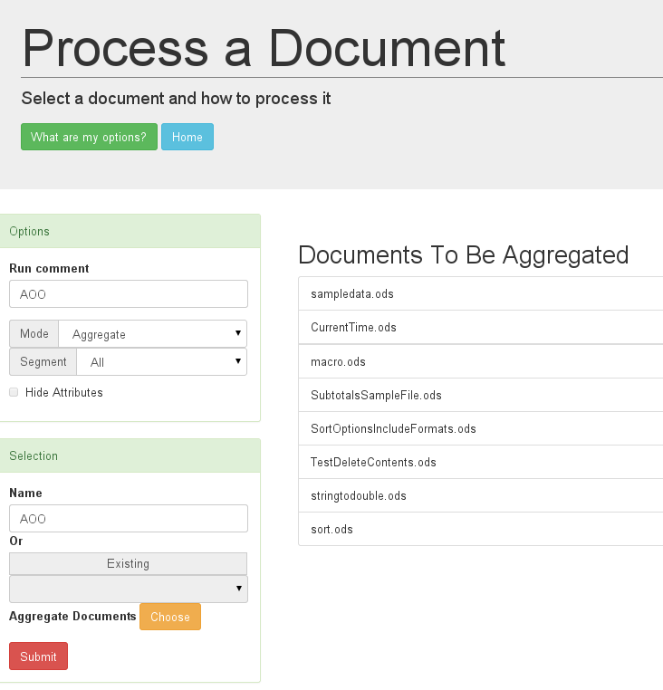

### Find some groups of documents

Aggregation is about seeing the cumulative changes of a document or set of documents.

I have extracted some test documents from [Apache OpenOffice](https://www.openoffice.org/). They are of different types, that is spreadsheets, presentations, and text documents.

### Aggregate a group or one

In this first iteration I am using a number of spreadsheet documents. The selection screen is shown below.

### Report options are not the same

Aggregating the style families over a number of documents doesn't realy make sense. So the style family report is disabled. For the moment it still shows up on the extract page but there is nothing under it.

Genertating XPath graphs based on the aggregates of elements needs to be handled differently. In the single case a path to a paragraph element is defined taking into account its attributes (style name for one). For aggregation we are just interested in general how the elements are connected.

This makes for far few paths. In fact the single document case has the oprion of ignoring the attributes when generating the paths graph too.

So the reports that make sense to look at are

* [Namespace Gauges](NamespacesAgg.html)

Before looking at the other reports I am going to perform another iteration. That is an aggregation run on the existing AOO.
I'm using a couple more spreadsheet documents.

* The XPath Table is much the same as in previous cases.
* [XPath Graph](XPathGraphAgg.html)
