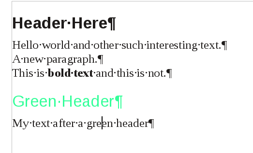
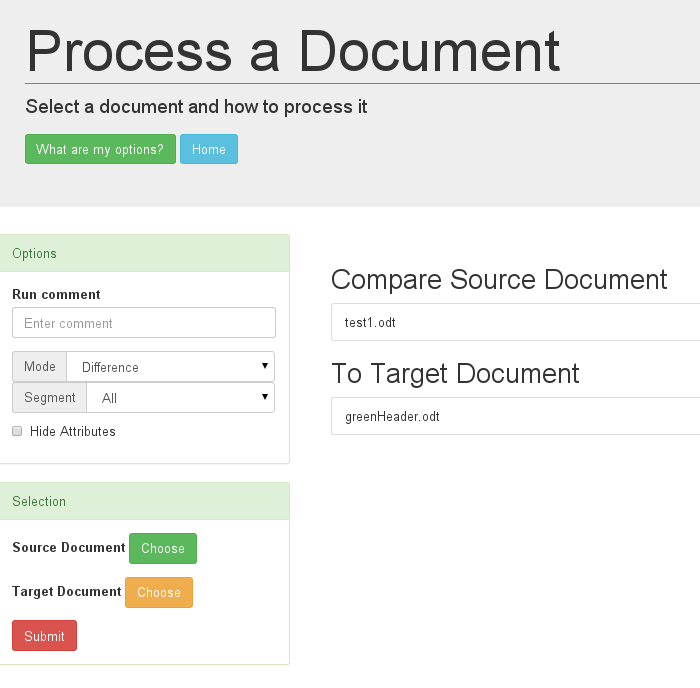

### Edit the a document

Take the test document of the test case and edit it. Again I'm going to use [Apache OpenOffice](https://www.openoffice.org/)
But you could equally use [LibreOffice](https://www.libreoffice.org/) or [Calligra](https://www.calligra.org/)

I changed the paragraph style to a newly created style My Style. And added a new, Green Header style, added a new header of that style, with an associated paragraph.

### Compare the a document

This time instead of processing the document as a single select, the Difference option and choose the source and target.

### Results

To see the results open the Comparison Reports from the top level and navigate into the document

Again the reports are, but this time the tool highlights the changes.

* [Namespace Gauges](NamespacesCompare.html)
* [Style Families](StyleFamiliesCompare.html)
* [XPath Table](XPathTableCompare.html)
* [XPath Graph](XPathGraphCompare.html)