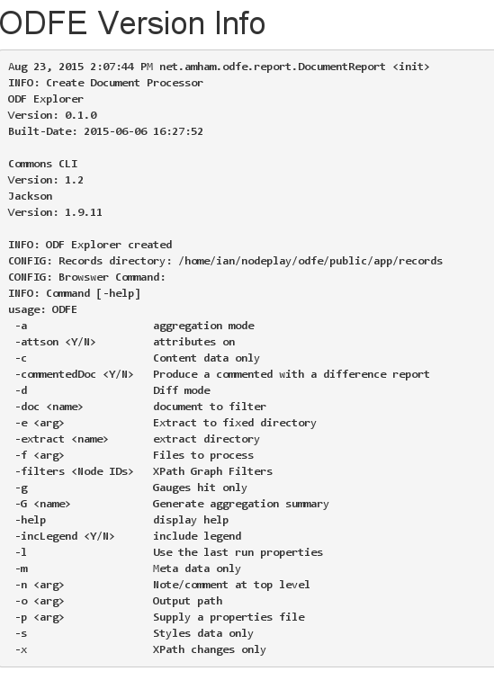

### ODF Explorer Info

Your info page should look something like\...

On Windows it may look slightly different because the list of associated jar files may be longer.

The important things to look for are the version and build date.

And the records directory should be based on where your installation is.

The command line options can be ignored, and will be removed in a future version.

